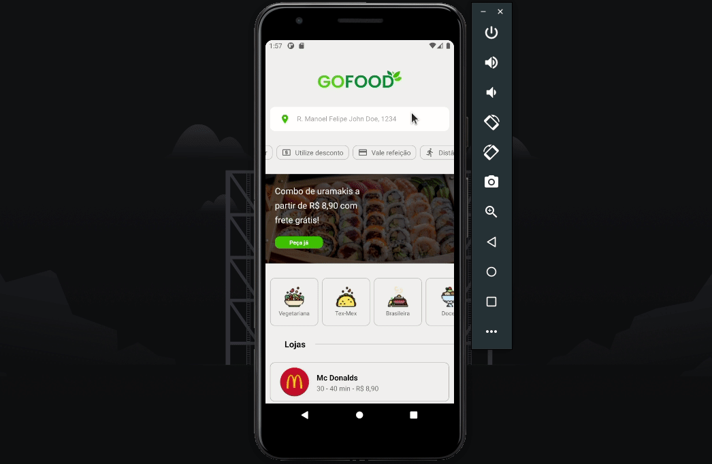

<h1 align="center">
  <br>
    
  </br>
</h1>

A aplicação GoFood abrange serviços de entrega online. Essa aplicaçãp garante que um usuário possa realizar um pedido por vez a um determinado restaurante ou estabelecimento, no qual estabelecimentos podem manter o contato com o cliente solicitante do pedido.

<p align="center">
  <a href="http://makeapullrequest.com">
    
  </a>
  <a href="http://makeapullrequest.com">
    
  </a>
</p>

  <br>
    
  </br>


## Tools
The following tools were used in the project:

- [React Native](https://reactnative.dev)
  - [Styled Components](https://styled-components.com/)
  - [React Navigation](https://reactnavigation.org/)
  - [Vector Icons](https://www.npmjs.com/package/react-native-vector-icons)

## Getting started

Before than started, you will need to install the following tools on your machine:
[Git](https://git-scm.com), [Node.js](https://nodejs.org/en/). 
In addition it is essential to have a text editor to work with the code like [VSCode](https://code.visualstudio.com/).

```bash
# clone this repository
$ git clone <https://github.com/fbsoares-lu/gofood.git>


# Go to the project folder
$ cd gofood

# Install all dependencies
$ yarn

# Generate the Metro bundle
$ npx react-native start 

# Start the application on Andoid Emulator
$ npx react-native run-android 

# Start the application on Ios Emulator
$ npx react-native run-android 
```
Create by [Lucas Soares](https://github.com/fbsoares-lu)
